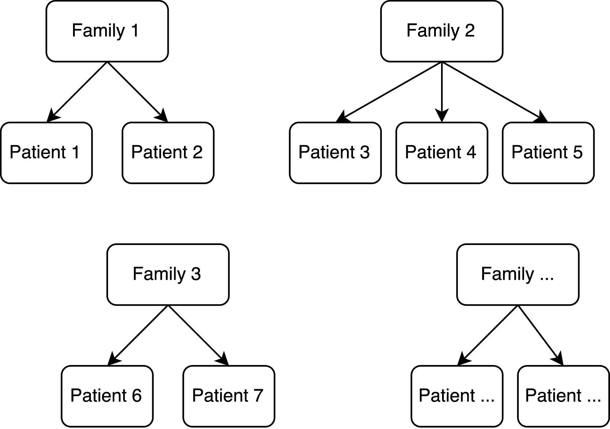

# Survival models with random effects {#smre}

Random effects models are a kind of hierarchical model in which the data is assumed to have some sort of hierarchical structure: for instance, individual patients data clustered into families, cities, regions, and so on (Figure \@ref(fig:clustering-ex)). It is also generally assumed that individuals are homogeneous within a hierarchical unit, heterogeneous between different units; by comparison, fixed effects models do not take into account any hierarchy or heterogeneity in the data. Additionally, the term "fixed effects" traditionally refers to the population-average effects while the term "random effects" refers to subject-specific effects, with the latter generally assumed to be unknown, unobserved variables.

```{r clustering-ex, fig.cap = "Example of clustered data", out.width = ifelse(knitr:::is_latex_output(), ".5\\textwidth", "50%")}

```

Random effects models are generally used to analyse hierarchical data with a continuous, normally distributed outcome; such models are referred to as linear mixed-effects models, as they can incorporate both fixed and random effects, and generalise the linear regression model. With data consisting of repeated observations over time, the terms longitudinal data is commonly used. It is possible to encounter hierarchical data originating from a variety of distributions from the exponential family such as the Poisson, Gamma, and Binomial distribution. Linear mixed-effects models can be generalised to include such data, and these models are generally referred to as generalised linear mixed-effects models. Practically speaking, it is the same process of generalising linear models to generalised linear models. Survival data can present a hierarchical structure too; for instance, data could be clustered in geographical areas, institutions, or patients themselves. Meta-analysis of individual-patient data is a common example of survival data (when the outcome is time to event) with some hierarchical structure; another example is given by repeated-events data, such as infections or acute recurrent events, in which the first level of the hierarchical structure consists in the patient. A final example of survival data with biological clusters is given by twin data, in which siblings share some genetic factors. This heterogeneity structure often leads to violation of the implicit assumption that populations are homogeneous: sometimes it is impossible to include all relevant risk factors, or maybe such risk factors are not known at all. The result is unobserved heterogeneity. The simplest survival model with random effects is the univariate frailty model, in which a random effect - named frailty - is included in the model to account for the unobserved heterogeneity. The univariate frailty model can be generalised by allowing the frailty term to be shared between observations belonging to the same cluster of data; the resulting models are named shared frailty model. The frailty term generally acts multiplicatively on the baseline hazard, and it is modelled on the hazard scale; it is possible to alternatively formulate the model in terms of random effects rather than frailties, by including the frailty as an additive term on the log-hazard scale.

I will introduce the univariate frailty model in Section \@ref(smre-univariate-frailty), and generalise it to allow shared frailty terms in Section \@ref(smre-shared-frailty). Finally, I will present the alternative formulation in terms of random effects in Section \@ref(smre-random-effects). A comprehensive treatment of frailty models in survival analysis is given in @hougaard_2000 and @wienke_2010.

## Univariate frailty models {#smre-univariate-frailty}

In those settings where risk factors are not measured, their relevance is unknown, or it is not known whether such risk factors exist at all or not, it is useful to consider two sources of variability in survival analysis: variability accounted for by observable risk factors included in the model and heterogeneity caused by unknown covariates. The unobserved heterogeneity is described by the frailty term, which is assumed to follow some distribution. Formally:
\[
h(t|\alpha) = \alpha h_0(t),
\]
where \(\alpha\) is a non-observed frailty effect and \(h_0(t)\) is the baseline hazard function.  The random variable \(\alpha\), the frailty term, is chosen to have a distribution \(f(\alpha)\) with expectation \(E(\alpha) = 1\) and variance \(V(\alpha) = \sigma ^ 2\). \(V(\alpha)\) is interpretable as a measure of heterogeneity across the population in baseline risk: as \(\sigma ^ 2\) increases the values of \(\alpha\) are more dispersed, with greater heterogeneity in \(\alpha h_0(t)\). Underlying assumptions are: the frailty is time independent, and it acts multiplicatively on the underlying baseline hazard function.

Introducing observed covariates into the model and inducing proportional hazards:
\[
h(t|X,\alpha) = \alpha h_0(t) \exp(X \beta) = \alpha h(t | X),
\]
with \(X\) and \(\beta\) covariates and regression coefficients, respectively. Given the relationship between hazard and survival function, it can be showed that the individual survival function conditional on the frailty is  \(S(t | \alpha) = S(t) ^ \alpha\). The population (i.e. marginal, or unconditional) survival function is obtained by integrating out the frailty from the conditional survival function:
\[
S(t) = \int_0^{+\infty} \left[ S(t) \right] ^ \alpha f(\alpha) \ d\alpha
\]

The individual contribution to the likelihood (assuming no delayed entry) is conditional on the unobserved frailty  \(\alpha\)
\[
L_i = \prod_{i = 1} ^ {n} \left( \alpha h_0(t_i)\exp(X_i \beta) \right) ^ {d_i} \exp(-\alpha H_0(t_i) \exp(X_i \beta)),
\]
with \(d_i\) event indicator variable, \(H_0(t_i)\) cumulative baseline hazard, and \(t_i\) observed survival time - all relative to the \(i\)-th individual.

Different choices for the frailty distribution are possible. Assigning a probability distribution implies that the frailty can be integrated out of the likelihood function. After this integration, the likelihood can be maximized in the usual way if an explicit form exists. Otherwise, more sophisticated approaches like numerical integration or Markov Chain Monte Carlo methods are required. The most often used frailty distributions are the gamma and the log-normal distribution; the positive stable and the inverse Gaussian distribution are also common.

Assuming that the frailty \(\alpha\) has a Gamma distribution is convenient: it has the appropriate range \((0, \infty)\) and it is mathematically tractable. A Gamma distribution with parameters \(a\) and \(b\) has density
\[
f(x) = \frac{x ^ {a - 1} \exp(- x / b)}{\Gamma(a)b ^ a};
\]
by choosing \(a = 1 / \theta\) and \(b = \theta\) the resulting distribution has expectation \(1\) and finite variance \(\theta\). In these settings, the model is analytically tractable: the population survival function has the form
\[
S(t) = (1 - \theta \log(S(t))) ^ {-1/\theta};
\]
the likelihood follows by substitution. Estimating such model becomes therefore straightforward, which likely contributed to the popularity of Gamma frailty models.

Together with the Gamma distribution, the log-normal distribution is the most commonly used frailty distribution, given its strong ties to random effect models; more on that in Section \@ref(smre-random-effects). Hence, assuming a log-normal distribution with a single parameter \(\theta > 0\) (for comparison with the mathematically tractable Gamma frailty model) with density
\[
f(x) = (2 \pi \theta) ^ {-\frac{1}{2}} x ^ {-1} \exp \left( -\frac{(\log x) ^ 2}{2 \theta} \right),
\]
the resulting model has a frailty whose expectation is finite. Nevertheless, this frailty distribution cannot be integrated out of the survival function analytically to obtain the population survival function or the likelihood.

## Shared frailty models {#smre-shared-frailty}

Further generalising the model presented in Section \@ref(smre-univariate-frailty), it is possible for the frailty effect \(\alpha\) to be shared between clusters of study subjects. Specifically, for the $j$-th observation in the $i$-th cluster:
\[
h_{ij}(t | \alpha_i) = \alpha_i h(t|X_{ij}).
\]
The conditional survival function is:
\[
S_{ij}(t | \alpha_i) = S_{ij}(t) ^ {\alpha_i}.
\]

In this setting, the cluster-specific contribution to the likelihood is obtained by calculating the cluster-specific likelihood conditional on the frailty, consequently integrating out the frailty itself:
\[
L_i = \int_A L_i(\alpha_i) f(\alpha_i) \, d\alpha,
\]
with \(f(\alpha)\) the distribution of the frailty, \(A\) its domain, and \(L_i(\alpha_i)\) the cluster-specific contribution to the likelihood, conditional on the frailty. The cluster-specific contribution to the likelihood is
\[
L_i(\alpha_i) = \alpha_i ^ {D_i} \prod_{j = 1} ^ {n_i} S_{ij}(t_{ij}) ^ {\alpha_i} h_{ij}(t_{ij}) ^ {d_{ij}},
\]
with \(D_i = \sum_{j = 1} ^ {n_i} d_{ij}\). Analogously as before, analytical formulae can be obtained when \(\alpha_i\) follows a Gamma distribution:
\[
L_i = \left[ \prod_{j = 1} ^ {n_i} h_{ij}(t_{ij}) ^ {d_{ij}} \right] \frac{\Gamma (1 / \theta + D_i)}{\Gamma (1 / \theta)} \left[ 1 - \theta \sum_{j = 1} ^ {n_i} \log S_{ij}(t_{ij}) \right] ^ {-1 / \theta - D_i};
\]
further details in @gutierrez_2002. As in the univariate frailty model, assuming a log-normal distribution requires some numerical approximation to be performed, being the resulting model analytically intractable.

## Alternative formulation {#smre-random-effects}

A shared frailty model assuming a log-normal distribution for the frailty term has strong ties to random-effects models. A log-normal frailty model is formulated as
\[
h_{ij}(t | \alpha_i) = \alpha_i h(t | X_{ij}) = \alpha_i h_0(t) \exp(X_{ij} \beta),
\]
with \(\alpha_i\) following a log-normal distribution. On the log-hazard scale:
\[
h_{ij}(t | \alpha_i) = h_0(t) \exp(X_{ij} \beta + \eta_i),
\]
with \(\eta_i = \log \alpha_i\). \(\eta_i\) results being normally distributed with parameters \(\mu\) and \(\sigma ^ 2\) related to those of the log-normal distribution by the relationship
\[
E(\alpha_i) = \exp(\mu + \sigma ^ 2 / 2)
\]
and
\[
Var(\alpha_i) = \exp(2 \mu + \sigma ^ 2) (\exp(\sigma ^ 2) - 1)
\]

By formulating the model on the log-hazard scale, the frailty term has a direct interpretation as a random intercept in the model. It is possible to further extend this model by allowing random covariates effects, potentially ranging over multiple levels of clustering. Using the usual mixed-effects model notation:
\[
h_{ij}(t | b_i) = h_0(t) \exp(X_{ij} \beta + Z_{i} b_i),
\]
with \(X_{ij}\) representing the design matrix for the fixed effects \(\beta\) and \(Z_i\) representing the design matrix for the random effects \(b_i\). Any distribution or functional form can be assumed for \(h_0(t)\) [@crowther_2014], or it is possible to leave it unspecified altogether yielding a semi-parametric Cox model with random effects [@ripatti_2000; @therneau_2003].
