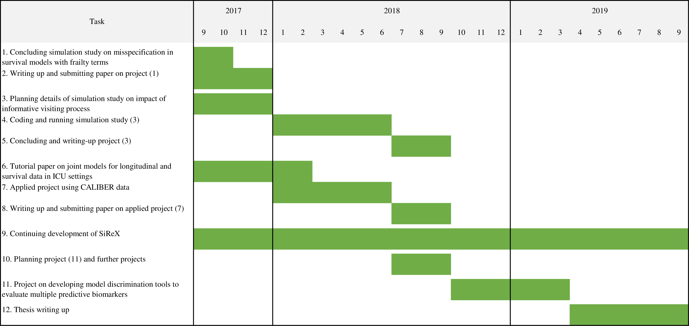

# Future research developments {#future}

In this Chapter I will present my plans for research during the second year of my PhD. I also included a Gantt chart in Figure \@ref(fig:gantt-chart).

First of all, I plan to conclude the simulation study on the impact of model misspecification in survival models with frailty terms. Simulations for some scenarios are currently still running on the University high-performance computing facilities at the time of writing, and should finish soon. Consequently, I will summarise the results in a meaningful way using tables and plots and I will finish writing up the project into a paper that will be submitted to a journal for publication by the end of the year. Current potential target journals are the Biometrical Journal and Statistics in Medicine.

At the same time, I will be planning the next project on modelling the visiting process and investigating the impact of an informative visiting process on inference using longitudinal data originating from healthcare records. This project aims to shed light on how an informative visiting process affects the analysis of longitudinal data that are intermittently and irregularly measured and recorded, in order to provide practical advice to applied researchers. In practice, I will be simulating complex survival data along with one or more longitudinal biomarkers under a variety of biologically plausible data-generating mechanisms; I will vary:
  
  1. the underlying risk of event, in terms of magnitude and shape of the baseline hazard;

2. the number and frequency of longitudinal measurements;

3. features of the longitudinal process such as functional form over time;

4. the strength of the informative observation process, i.e. the magnitude of the association between the underlying disease process and the observation process;

5. the shape of the association between the observation process and the disease process, i.e. the parametrisation that links the two processes (e.g. the current value parametrisation, intercept and slope, cumulative effect, and so on);

6. eventually, sample size in terms of study subjects.

Then, I will compare different analytical approaches proposed in literature to tackle the problem, starting with simple approaches such as including the number of preceding measurements in the model as a proxy of disease severity moving onto more complex methods such as those introduced in Section \@ref(infvp). Some methods will be directly applicable using existing software, while others will require developing ad-hoc software if an existing implementation is not available in standard statistical packages such as R and Stata. Throughout this project we will be collaborating with Dr. Jessica Barrett from the MRC Biostatistic Unit in Cambridge, and we will have extensive meetings to discuss factors that may affect the results of this study and what methods to include and compare. Once the planning phase is completed, I will code the simulation study and and run it using the high-performance computing facilities of the University. Finally, I plan to write up the project and produce a manuscript approximately at the end of my second year.

During my second year I will also work on an applied project in the area of cardiovascular epidemiology using joint models for multiple longitudinal biomarkers and survival data using CALIBER data [@denaxas_2012]. CALIBER includes a wide variety of biomarkers such as systolic and diastolic blood pressure, body-mass index, high- and low-density cholesterol, and so on. These biomarkers are likely to be correlated as they change over time, and they may improve cardiovascular risk prediction and clear up the complex relationship between changes in the biomarkers and the risk of adverse events. Specifically, I will select a cohort of individuals with stable angina and type 2 diabetes (for whom regular monitoring of blood pressure is recommended) and evaluate the association between multiple, longitudinally measured biomarkers and the risk of adverse coronary events, fatal and non-fatal.

The applied project using CALIBER data will inform further projects, such as studying and developing discrimination and calibration tools to use with multiple longitudinal biomarkers. The importance of discrimination and classification tools is great, as it is fundamental to be able to classify whether additional biomarkers can improve predictions or not; this project will have wide reaching consequences by providing guidance in the use of joint models when developing risk predictions using multiple biomarkers. I aim to work on this during the final year of my PhD.

Finally, an ongoing task will be the continuous development and expansion of the interactive tool for exploring results from simulation studies. For instance, potential developments will include:
  
  * polishing the underlying engine used to computed summary statistics;

* including more plots;

* allowing custom faceted plots and tables comparing multiple factors at once.

```{r gantt-chart, fig.cap = "Gantt chart for current and future projects during my PhD.", out.width = ifelse(knitr:::is_latex_output(), ".9\\textheight", "100%"), out.extra = if (knitr:::is_latex_output()) {"angle = 90"}}

```
