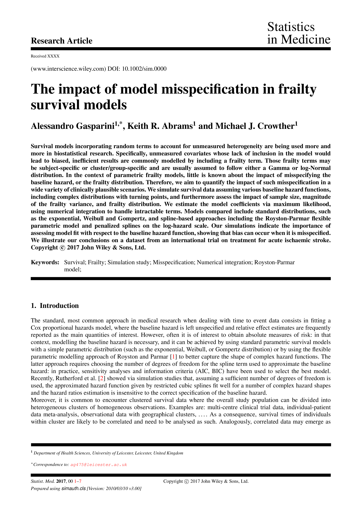
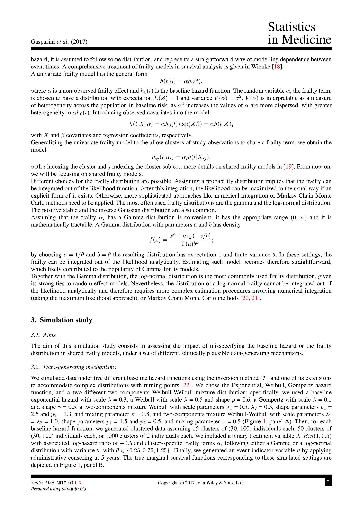
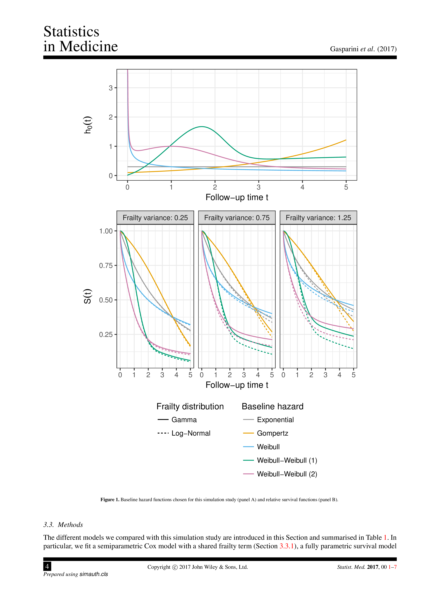
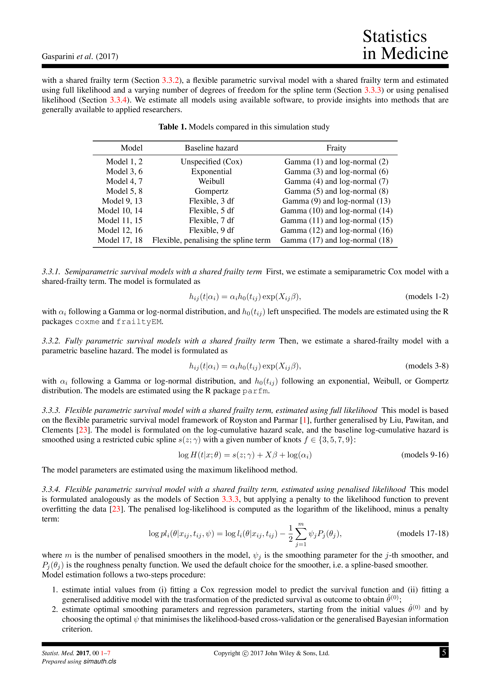
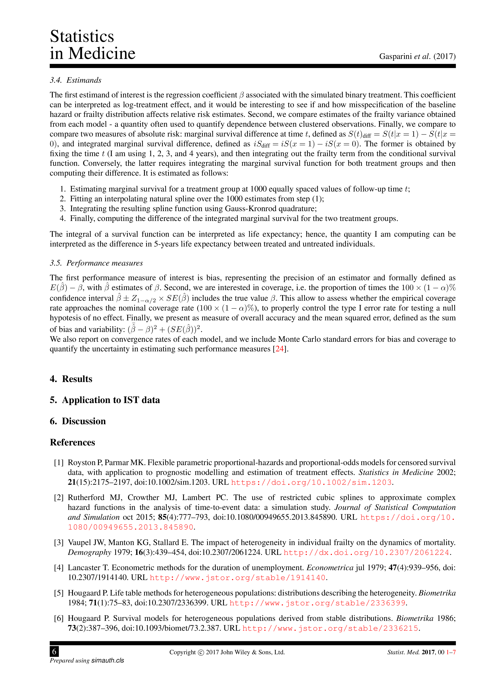
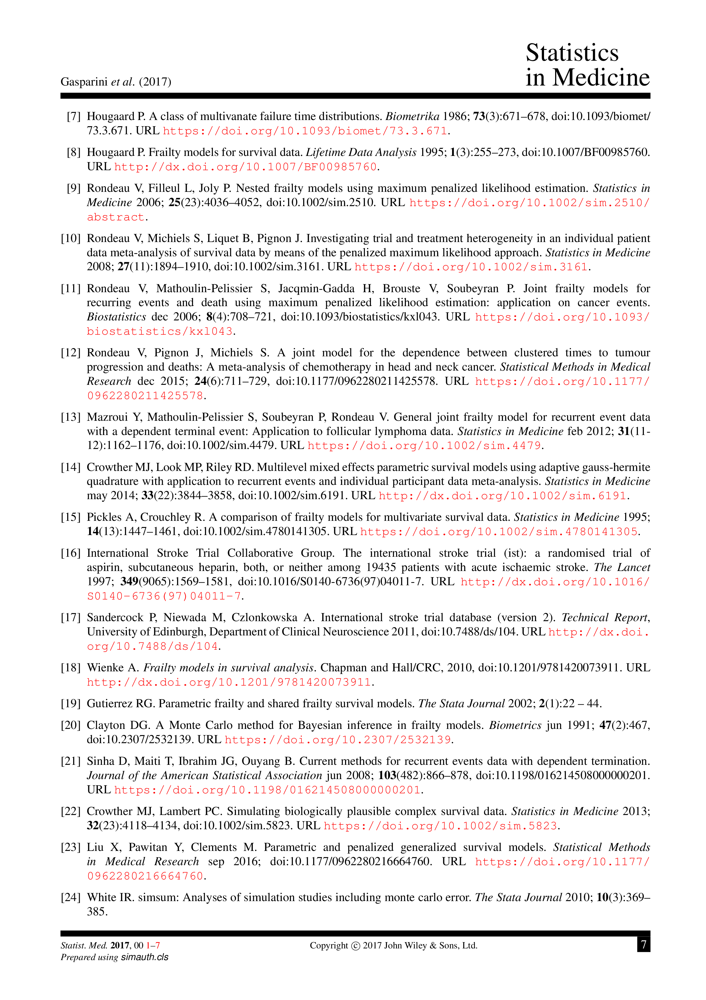

# Manuscript draft {#ax-manuscript}

`r if (knitr:::is_latex_output()) '\\clearpage'`

```{r manuscript-draft, out.width = ifelse(knitr:::is_latex_output(), "1\\textwidth", "100%")}

include_graphics("manuscript/manuscript-1.png")





```
